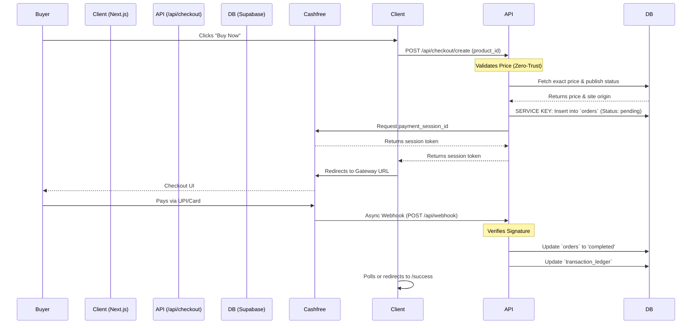

# 🏗️ DigiOne: CTO-Level Architecture & Scaling Audit

**Author:** Staff+ Engineering / CTO Office  
**Target Audience:** Senior Engineering Leadership, DevOps, SecOps, Lead Developers  
**Date:** Current  

This document represents a deep, uncompromising audit of the DigiOne codebase. It assesses the present state of the MVP, exposes hidden technical debt, outlines the architecture layer-by-layer, and sets the immediate roadmap required to scale this platform to millions of creators and buyers.

---

## 1. Executive Summary

- **What it does:** An all-in-one monetization SaaS for Indian digital creators (Storefronts, Links-in-Bio, Checkout, Marketing Automation).
- **Revenue Model:** Free/Subscription tiers + Platform transaction fees via Cashfree.
- **Core Engineering Philosophy:** Speed-to-market. Heavy reliance on Vercel (Edge/Serverless) and Supabase (BaaS) to offload infrastructure management.
- **Current Maturity:** **Late-Stage MVP / Pre-Scaling Production**. Core flows work, but it lacks the caching, queuing, and security layers required for high-volume enterprise traffic.

### 📊 Platform Scorecard
| Metric | Score (1-10) | Verdict |
| :--- | :--- | :--- |
| **Overall Architecture** | **7.5/10** | Solid Next.js 15 App Router foundation, but backend mutations are sloppy. |
| **Developer Experience** | **8.0/10** | High. Tailwind v4 and React 19 keep UI development blazing fast. |
| **Scalability Readiness** | **4.0/10** | Danger. Direct Postgres reads on public storefronts will crash under viral traffic. |
| **Security Readiness** | **6.5/10** | Good RLS rules, but heavy use of `as any` in API routes masks runtime injection risks. No anti-bot. |
| **Technical Debt** | **Medium-High** | UI is clean, but DB schema vs Typescript typing is out of sync in critical payment files. |

### The "What's Impressive" vs. "What's Dangerous"
**Impressive:**
- The storefront rendering engine (e.g., `app/(storefront)/link/[username]/page.tsx`) uses Next.js server components elegantly.
- Server-side price validation in `app/api/checkout/create/route.ts` proves the original devs understood zero-trust client models.

**Dangerous / Problematic:**
- **The `as any` Epidemic:** The checkout API uses `(supabase as any).from('orders')`. This completely breaks Type safety on financial ledgers.
- **No Edge Caching:** Public storefronts make 3-4 synchronous Supabase queries per page load. 10,000 concurrent visitors will instantly exhaust the Supabase connection pool resulting in global 500 errors.

---

## 2. Complete Architecture Breakdown

### 🖥️ Frontend Layer (Next.js 15)
- **Rendering Strategy:** Heavily SSR (Server-Side Rendered) for dynamic creator storefronts. Private routes (`/dashboard`) are gated. 
- **State Management:** Local client state is managed via `Zustand` (excellent choice for sidebar UI and builders). Server state is fetched via `React Query` or native React Server Components (RSC).
- **Hydration:** Clean RSC boundaries. Components that don't need `useState` or `useEffect` remain on the server, shipping zero JavaScript to the client.

### ⚙️ Backend Layer (Supabase BaaS + API Routes)
- **API Routes (`/app/api`):** Act as the secure middleman for financial operations.
- **Authentication:** Supabase Auth (JWT). 
- **Service Layer Pattern:** The client never writes to `orders`. It POSTs to `/api/checkout/create`, which uses `SUPABASE_SERVICE_KEY` to bypass Row Level Security (RLS) and execute secure backend inserts.

### 🗄️ Database Layer (Supabase Postgres)
- **Schema:** Massive 72-table structure indicating high feature maturity (Affiliates, KYC, Community Posts, Orders).
- **RLS (Row Level Security):** High dependency. Creators can only read their own metrics based on `auth.uid()`.
- **Integrity:** Good foreign key enforcement (`fk_crs_order`, `fk_kyc_creator`). 

### ☁️ Infrastructure Layer (Vercel)
- **Hosting:** Vercel Edge Network. 
- **Vulnerability:** Serverless architectures have cold starts and 10s timeout limits. This is dangerous for processing slow external Webhooks (Cashfree).

---

## 3. Folder-by-Folder Deep Dive

| Path | Architectural Purpose | Conventions & Traps |
| :--- | :--- | :--- |
| `/app/(storefront)` | Dynamic public rendering. Highly critical path. | **Trap:** Do not add heavy client libraries here. Every KB affects Creator SEO. |
| `/app/api/checkout` | The central nervous system for money. Generates orders and Cashfree tokens. | **Trap:** Hacky error handling exists here (e.g., falling back to `baseInsert` if `creator_id` fails). This needs urgent refactoring. |
| `/src/components` | Domain-driven UI components (`/dashboard`, `/ui`, `/marketing`). | **Convention:** Must exclusively use Tailwind classes. |
| `/src/lib/supabase` | Singleton connections. | **Convention:** Never invoke `createClient()` outside of this singleton in client views. |
| `/types` | `database.types.ts` is the single source of truth. | **Trap:** Developers are bypassing it using `as any` in API routes. |

---

## 4. Complete Request Lifecycle: Product Purchase Flow

**Where failures happen:** If Vercel times out the Webhook API route before the DB writes are finished, the buyer loses money but gets no product. (Requires background queue).

---

## 5. Database Intelligence Analysis

### Core Entities
- **Financial Engine:** `orders`, `order_items`, `creator_balances`, `creator_payout_requests`, `creator_revenue_shares`. 
- **Risk Assessment:** The `creator_revenue_shares` table calculates exact platform fees and creator earnings per order. This is highly precise but computationally heavy if queried synchronously on the dashboard. 

### Bottleneck Risks & Over-fetching
- **N+1 Queries:** Rendering a storefront currently fetches `site` -> `linkinbio_pages` -> `linkinbio_blocks` -> `linkinbio_items`. Four sequential round-trips to Postgres. At 50ms per trip, this adds 200ms of TTFB latency.
- **Dangerous Mutation:** Developers are casting types in mutations: `(supabase.from('orders') as any).insert(...)`. If the schema changes, Typescript will not catch the error, leading to silent failures in production checkouts.

---

## 6. React & Next.js Architecture Audit

- **Server Components:** Excellent use of RSCs for data fetching in `app/`. It prevents massive JS bundles from shipping to the buyer's browser.
- **Zustand Architecture:** Good abstraction for global dashboard state (e.g., active workspaces). 
- **Anti-Patterns:** 
  - Using `.maybeSingle()` in DB fetches instead of strict `.single()` when a row is mathematically guaranteed to exist. It hides data integrity bugs.
  - Doing data-fetching sequentially instead of `Promise.all()` in storefront renders.

---

## 7. Security Audit (Critical Findings)

| Vulnerability Vector | Severity | Exploit Scenario | Fix Required |
| :--- | :--- | :--- | :--- |
| **API Type Casting** | **High** | Using `as any` allows passing unverified JSON payloads directly to Postgres `insert()`. | Remove `as any`. Map payloads strictly to `Database['public']['Tables']['orders']['Insert']`. |
| **Bot Traffic (Carding)** | **High** | Hackers write bots to test stolen credit cards against `/api/checkout/create`. Cashfree will ban the merchant account. | Implement **Cloudflare Turnstile** on the checkout button UI immediately. |
| **Unsafe Content Uploads** | **High** | Creators upload NSFW images as storefront banners. Vercel/Cloudflare bans `digione.ai`. | Implement **AWS Rekognition** content moderation in the `/api/upload` route. |

---

## 8. Scalability & Performance Audit (The 1M Creator Test)

If the platform goes viral tomorrow, **it will fail.** 

1. **The Supabase Connection Pool Crash:** Next.js Server Components run on Edge/Serverless. If 10,000 buyers hit a creator's link, 10,000 serverless functions spin up, each creating a unique DB connection. Supabase allows ~500 concurrent connections. The pool exhausts, resulting in 500 timeouts.
2. **Bandwidth Bankruptcy:** Creator uploaded images (10MB RAW) are served directly. 100M page views of 10MB images = 1 PB of bandwidth. Vercel will charge thousands of dollars or block the account.

### 🚀 The CTO Scaling Plan
1. **Caching (Immediate):** Implement **Upstash Redis**. When a storefront loads, cache the JSON representation in Redis. Only hit Postgres if the cache is stale.
2. **ISR (Immediate):** Use Next.js `revalidate` aggressively. Serve static HTML for storefronts.
3. **Image Optimization (Immediate):** Pipe all images through **ImageKit.io** or Cloudflare Images to convert to WebP.
4. **Queue Architecture (Mid-Term):** Replace direct Webhook processing with **Inngest**. Cashfree webhooks go to Inngest queue -> Inngest reliably updates DB. No Vercel timeout limits.

---

## 9. Code Quality & Maintainability

- **Technical Debt Hotspots:** `app/api/checkout/create/route.ts` is a mess of fallback logic (`let orderError... if error includes 'creator_id' fallback`). This implies the Database Migration and the Application code are out of sync.
- **Refactor Candidate #1:** Standardize all Database types. Strip `any` from the codebase.
- **Modularity:** High. Component separation into `(storefront)`, `(marketing)`, `(buyer)` is brilliant and prevents styling/logic pollution.

---

## 10. Product & Feature Intelligence

- **Completed:** Link-in-bio generation, Checkout core flow, Basic analytics, Supabase Auth.
- **Abandoned/Pivoted:** Commits show "Deleted Blog and Builder". The team wisely shrank the scope to core commerce before going to market.
- **Hidden Roadmap:** `creator_kyc` and `creator_payout_methods` tables are heavily populated with complex fields (PAN enc, Bank enc). The team is preparing for massive, legally compliant financial scaling natively in India.

---

## 11. Developer Onboarding Roadmap

**First 7 Days:**
1. **Day 1-2:** Master the data. Read `types/database.types.ts`.
2. **Day 3:** Understand RSCs. Trace the path of `app/(storefront)/link/[username]/page.tsx` top-to-bottom.
3. **Day 4-5:** The Money flow. Read `/api/checkout` and `/api/webhook`.

**Safe to Modify:** `/src/components/marketing` and `/src/components/ui`.
**DO NOT TOUCH WITHOUT ARCHITECT APPROVAL:** `/app/api/checkout`, `/app/api/webhook`, and anything interacting with `creator_balances` or `transaction_ledger`.

---

## 12. DevOps & Deployment Review

- **Current:** Standard Vercel push-to-deploy.
- **Weakness:** No staging database separation explicitly defined in code routing (sandbox logic exists inside route logic via `process.env.CASHFREE_ENVIRONMENT`, but DB is singular).
- **Required Upgrade:** 
  1. Migrate DB backups to PITR (Point-in-Time Recovery).
  2. Implement **Sentry** for API failure tracking. We currently have no idea if a webhook drops silently.
  3. Prepare migration to **Coolify + Digital Ocean** for when Vercel bandwidth costs exceed $1000/mo.

---

## 13. AI-Assisted Engineering Opportunities

To achieve a massive valuation multiplier, DigiOne should integrate AI defensively and offensively:
1. **Defensive (AI Moderation):** Auto-reject explicit or copyrighted material using AWS Rekognition/Vision APIs during the `upload` flow.
2. **Offensive (AI Marketing):** Creators are bad at copywriting. Add an AI button in the product creator UI that generates SEO-optimized product descriptions and automated DM scripts using Gemini 1.5.

---

## 14. Top 10 Immediate Priorities for Leadership

1. 🔴 **CRITICAL:** Remove `any` casting in `/api/checkout/create` and fix the DB schema mismatch.
2. 🔴 **CRITICAL:** Implement Redis caching on storefront rendering.
3. 🔴 **CRITICAL:** Add ImageKit/Cloudflare for image optimization.
4. 🟡 **HIGH:** Implement Cloudflare Turnstile on checkout.
5. 🟡 **HIGH:** Hook up Sentry to track webhook and API failures.
6. 🟡 **HIGH:** Implement Inngest for background Cashfree webhook processing.
7. 🔵 **MED:** Move sequential DB fetches in `app/(storefront)` to `Promise.all()`.
8. 🔵 **MED:** Connect the mocked Subscriptions UI to the live `subscriptions` DB table.
9. 🔵 **MED:** Setup Supabase PITR (Point-in-Time Recovery) before launch.
10. 🔵 **MED:** Establish strict staging vs. production database branches.

*Audit complete. The codebase has a spectacular foundation but requires stabilization before turning on the marketing firehose.*
