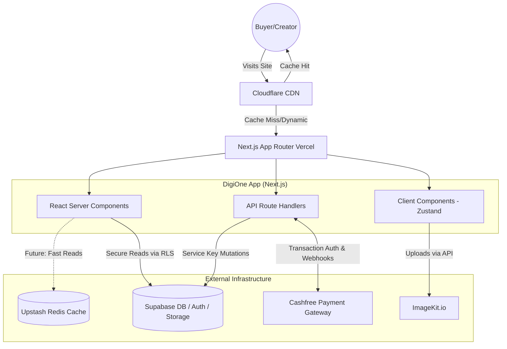

# 🚀 DigiOne Developer Onboarding & Architecture Guide

Welcome to **DigiOne**! You are joining an ambitious project designed to be India's ultimate all-in-one creator monetization platform.

This guide is designed to accelerate your onboarding. It covers everything from the high-level business goals to the low-level technical execution of our codebase. Read it carefully—it will save you weeks of debugging and architecture questions.

---

## 1. Project Overview

### What this project does
DigiOne is a full-featured SaaS platform built specifically for Indian digital creators. It collapses the fragmented creator stack (Gumroad + Linktree + Mailchimp + Notion) into a single unified platform. 

### Business Purpose & Target Users
- **Target Users:** Indian digital creators, educators, indie hackers, and coaches (aged 22-38) selling digital products like Notion templates, Figma files, online courses, and ebooks.
- **Business Purpose:** To provide a premium, zero-friction way for creators to manage products, build customized Link-in-Bio pages, run automated DM marketing, and securely process payouts in INR (₹) straight to their bank accounts.

### Core Problem it Solves
Currently, Indian creators lose conversions and pay exorbitant foreign exchange fees by stitching together international tools. DigiOne solves this by offering an India-first, fully integrated platform with native INR pricing, PAN-linked identity verification (KYC), and automated bank settlement via Cashfree.

### Architecture in Simple Terms
DigiOne operates as a modern **Serverless Web Application**. 
1. **Frontend:** Buyers and creators interact with a blazing-fast Next.js frontend hosted on the edge (currently Vercel).
2. **Backend/Database:** The data is securely stored in a 72-table Supabase Postgres database. 
3. **Payments:** Transactions are handled via the Cashfree SDK.
4. **Data Flow:** The public storefronts are heavily cached/statically generated, while the private dashboard directly queries the database through strict secure client rules and server-side API routes for sensitive mutations.

---

## 2. Tech Stack Analysis

| Technology | Role | Why it was chosen | Alternatives / Verdict |
| :--- | :--- | :--- | :--- |
| **Next.js 16.1.7 (App Router)** | Full-stack framework | Native React 19 support, Server Components (RSC) for incredible performance, and built-in ISR for storefront caching. | *Remix/Vite*: Next.js App Router is currently the industry standard for React and offers better native deployment on Vercel. **Excellent choice.** |
| **React 19** | UI Library | The latest standard with concurrent rendering and hooks. | N/A |
| **Tailwind CSS v4** | Styling | Rapid UI development without writing custom CSS files. Enforces design consistency. | *CSS Modules/Styled Components*: Tailwind v4 is much faster and standard for modern SaaS. **Excellent choice.** |
| **Supabase** | Backend-as-a-Service | Provides managed Postgres, Authentication, Row-Level Security (RLS), and Storage in one package. | *Firebase/AWS*: Supabase offers raw SQL power with RLS which is crucial for our multi-tenant SaaS architecture. **Excellent choice.** |
| **Cashfree** | Payment Gateway | Native Indian payment gateway supporting UPI, NetBanking, and automated creator settlements. | *Razorpay/Stripe*: Cashfree is highly competitive for marketplace payouts and KYC handling in India. **Good choice.** |
| **Zustand** | Client State Management | Lightweight, fast, and removes the massive boilerplate of Redux. | *Redux Toolkit*: Zustand is vastly superior for local UI states like our Dashboard Sidebar. **Excellent choice.** |
| **React Query v5** | Server State Caching | Handles data fetching, caching, synchronization, and updates asynchronously. | *SWR*: React Query is more robust for complex mutations. **Excellent choice.** |
| **Framer Motion** | UI Animations | Essential for achieving the "Premium SaaS Aesthetic" with micro-animations. | *GSAP*: Framer is more React-native. **Excellent choice.** |

---

## 3. Folder & File Structure

The project strictly divides routing (`/app`) from business logic and UI (`/src`).

### The `/app` Directory (Routing & APIs)
- `/(auth)`: Supabase login/signup flows.
- `/(marketing)`: Public splash pages and high-conversion landing pages.
- `/(storefront)`: The dynamic public rendering engine for creators (e.g., `/link/[username]`). Heavily relies on SSR and `generateStaticParams`.
- `/(buyer)`: Checkout experiences.
- `/dashboard`: The secure CRM space. Highly gated. Houses `/sites` (the visual builder).
- `/api`: Secure server-side handlers. Includes `/checkout` (Cashfree), `/webhook` (payment confirmation), and `/upload`.

### The `/src` Directory (Logic & UI)
- `/components/dashboard`: Highly interactive, Zustand-dependent components (e.g., `Sidebar.tsx`).
- `/components/storefront`: Public display elements optimized for speed and conversion.
- `/components/marketing`: Hero sections, pricing tables.
- `/components/ui`: Foundational, reusable Tailwind primitives (Buttons, Inputs).
- `/hooks`: Custom React behavior (`useCreator`, React Query data fetchers).
- `/lib/supabase/client.ts`: **The Singleton Database Client.**
- `/types/database.types.ts`: Auto-generated 72-table Supabase schema types.

---

## 4. Codebase Deep Dive

### Strict Architectural Rules
1. **No Component Singletons:** You must NEVER run `createClient()` inside a React component. Always import instances from `lib/supabase/client.ts`.
2. **Immutable Finances:** Client code cannot write to `creator_balances`, `transaction_ledger`, or `orders` tables. There are ZERO client-write RLS policies for these. Financial mutations must hit a Server Route Handler (`/api/*`) using the Supabase Service Key.
3. **Currency & Styling:** Everything is in **INR (₹)**. All UI uses strictly Tailwind classes (or CSS variables `var(--bg-secondary)` for the theme engine). Inline styles are implicitly banned.
4. **Mandatory Documentation:** Every new or modified file requires a 2-line comment at the top explaining its utility and which DB tables it interacts with.

### How Frontend and Backend Communicate
- **Public Data:** Fetched using React Query or Next.js Server Components.
- **Private Data:** Dashboard fetches via authenticated Supabase client using RLS.
- **Sensitive Operations (Payments/Ledgers):** The frontend issues a POST to `/api/checkout`. The server validates the request, safely executes the Supabase Service Key query, talks to the Cashfree SDK, and returns the result.

---

## 5. Present State of the Project

**What's Working:**
- The Next.js 16 App Router foundation and Tailwind v4 engine are fully set up.
- The Dashboard UI (`Sidebar`, navigation) and Homepage UI are solidly built (recently fixed in commits).
- Basic Supabase authentication and database connection logic is established.
- The `database.types.ts` suggests a massive and complete 72-table schema exists.

**What is Incomplete / Technical Debt:**
- **Mocked Data:** Files like `app/dashboard/settings/subscription/page.tsx` contain `const currentPlan = 'free'; // TODO: fetch from subscriptions table`. Parts of the dashboard UI are built visually but disconnected from live DB state.
- **Missing Infrastructure:** As per `configuration-plan.md`, critical scaling tools like Redis (Caching), ImageKit (Image Optimization), and Turnstile (Anti-bot) are currently completely missing and need to be implemented.
- **Hosting Tier:** The app is currently targeted at Vercel/Supabase free tiers, meaning it is highly vulnerable to bandwidth caps and connection limit crashes.

---

## 6. Past Evolution of the Project

Based on the commit history and file structure:
- **Heavy Frontend Focus:** The last 20 commits (`Dashboard UI`, `homepage ui`, `UI FIXED x80 Pages`) show a massive push to finalize the premium SaaS aesthetic before wiring up the heavy backend logic.
- **Pivots & Pruning:** A commit notes `Deleted Blog and Builder and Organised`. This suggests the team initially built massive features (like a full blog builder) but pivoted to refine the core MVP (Link-in-bio and single product storefronts) to reduce complexity.
- **Logo and Branding:** Multiple commits tweaking logos and OG images indicate a recent focus on marketing readiness and brand presentation.

---

## 7. Future Improvements & Scaling

As outlined in our `configuration-plan.md`, the platform must survive massive traffic spikes from creators going viral. 

**Immediate Priorities (MVP to Scale):**
1. **Caching (Redis/Upstash):** Storefront requests MUST hit a Redis cache, not the Postgres database. This prevents 10,000 viral hits from maxing out Supabase connection pools.
2. **Next.js ISR:** Use Incremental Static Regeneration for storefronts so Next.js serves static HTML via Cloudflare instead of rendering on every request.
3. **Image Optimization (ImageKit / Cloudflare):** Auto-compress creator uploads (10MB → 100KB WebP) to protect our LCP scores and bandwidth costs.
4. **Bot Protection (Turnstile):** Implement on checkout/login to prevent automated carding attacks.
5. **Content Moderation (AWS Rekognition):** Scan uploaded images automatically to prevent NSFW content from getting our domains banned.
6. **Background Jobs (Inngest):** Move email sending and Cashfree webhook processing to background queues to prevent Vercel 10-second timeout crashes.

**Long-Term Infrastructure:**
Move off expensive Vercel bandwidth onto a **Digital Ocean VPS with Coolify**, utilizing Cloudflare extensively to serve cached content.

---

## 8. Developer Experience

### Running Locally
1. Clone the repo and run `npm install`.
2. Duplicate `.env.example` to `.env.local` and add:
   - `NEXT_PUBLIC_SUPABASE_URL` & `NEXT_PUBLIC_SUPABASE_ANON_KEY`
   - `SUPABASE_SERVICE_ROLE_KEY`
   - `CASHFREE_APP_ID` & `CASHFREE_SECRET_KEY`
3. Run `npm run dev` (Port 3000).

### Rules of Engagement
- **Linting:** Run `npm run lint` before committing. ESLint compliance is non-negotiable.
- **Type Generation:** If you modify the database in Supabase, run `npm run update-types` to regenerate `types/database.types.ts`.
- **Debugging:** Use React Query Devtools to inspect client-side caching. For API routes, check your terminal logs. When we integrate Sentry, use the Sentry dashboard for production tracing.

---

## 9. Risk Analysis

| Risk Type | Description | Mitigation Strategy |
| :--- | :--- | :--- |
| **Scalability Bottleneck** | Viral traffic to a storefront will exhaust Supabase DB connections instantly. | Implement Upstash Redis caching immediately for public storefront endpoints. |
| **Security vulnerability** | RLS Bypass: Developers using `supabase.auth.admin` or Service Role keys in client components. | Strict code review; automated ESLint rules preventing import of service keys outside `/api`. |
| **Performance Issue** | Unoptimized creator image uploads (e.g., 15MB banners) destroying mobile load times. | Integrate ImageKit.io or Cloudflare Images in the `/api/upload` pipeline. |
| **Financial Risk** | Carding bots testing thousands of stolen credit cards on our checkout endpoints. | Add Cloudflare Turnstile to the checkout wrapper. |
| **Reliability** | Next.js API timeouts (10s limit) failing to process Cashfree payment webhooks. | Implement Inngest/Trigger.dev for background webhook processing. |

---

## 10. Learning Roadmap for You

Since you are new, follow this exact sequence to ramp up without getting overwhelmed:

1. **Phase 1: Understand the Data (Day 1)**
   - Read `src/types/database.types.ts` to understand the 72-table structure.
   - Look at `src/lib/supabase/client.ts`.
2. **Phase 2: Understand the UI & State (Day 2-3)**
   - Explore `/src/components/ui` to see our Tailwind v4 primitives.
   - Explore `/src/components/dashboard/Sidebar.tsx` and see how it interacts with Zustand state.
   - *Beginner Task:* Find a static UI element in the dashboard (like the `TODO` in the Subscriptions page) and wire it up to a simple Supabase read query using React Query.
3. **Phase 3: The Routing Engine (Day 4-5)**
   - Explore `/app/(storefront)/link/[username]/page.tsx` (the file you had open!). Understand how we dynamically route and render a creator's page based on the URL parameter.
4. **Phase 4: Advanced Backend (Week 2)**
   - Dive into `/app/api/checkout` and `/app/api/webhook`. Learn how Cashfree communicates with our secure server routes and how we bypass RLS using the Service Key to safely write to the ledger.

---

## 11. Final Deliverables & Maps

### 🏗️ Complete Architecture Summary



### 🗺️ Important File Map

```text
digionev1/
├── app/
│   ├── (storefront)/link/[username]/page.tsx  <-- The core Link-in-bio rendering engine
│   ├── dashboard/page.tsx                     <-- Main creator CRM view
│   ├── api/checkout/route.ts                  <-- Secure payment initialization
│   └── api/webhook/route.ts                   <-- Async Cashfree payment ledger updates
├── src/
│   ├── lib/supabase/client.ts                 <-- ONLY PLACE createClient() should exist
│   ├── types/database.types.ts                <-- Source of truth for all Typescript interfaces
│   ├── components/dashboard/Sidebar.tsx       <-- Core navigation & Zustand usage
│   └── hooks/useCreator.ts                    <-- Zustand state hook example
├── package.json                               <-- Contains all scripts (dev, build, update-types)
└── configuration-plan.md                      <-- The CEO/CTO's blueprint for scaling infrastructure
```

### 🔄 Request Lifecycle: Buyer Checkout Flow

1. Buyer clicks "Buy Now" on `/(storefront)/p/[product_id]`.
2. Client Component triggers a `POST /api/checkout` with `productId`.
3. Server route verifies product exists in Supabase.
4. Server pings Cashfree SDK to generate a `payment_session_id`.
5. Server responds to Client; Client redirects buyer to Cashfree hosted checkout.
6. Buyer pays. Cashfree fires a hidden POST to our `/api/webhook`.
7. Webhook uses **Supabase Service Key** to insert an immutable row into `transaction_ledger` and `orders`.
8. Buyer redirected to `/(buyer)/success` where Server Component securely queries their new order.

### ✅ Beginner Onboarding Checklist

- [ ] Read `AGENTS.md` and `README.md` in the root.
- [ ] Configure local `.env.local` keys.
- [ ] Spin up the app (`npm run dev`) and successfully log in using Supabase Auth.
- [ ] Make a minor CSS variable change in a `src/ui` component and see it hot-reload.
- [ ] Identify one `TODO` comment in the codebase and map out what Supabase table it needs to read from.

Welcome to the team! Start exploring the `/app` and `/src` directories, and let's build the best creator platform in India.
