# DigiOne Entity-Relationship Diagram

The foreign-key graph below was derived from the live Supabase database (`qcendfisvyjnwmefruba`) on 2026-06-14 using the `production_fixes` migration as the baseline. It reflects 90 FK relationships across 63 public tables. Entity names are exact; only FK edges are shown (column names are omitted from the diagram for readability — see `schema-reference.md` for per-table detail).

```mermaid
erDiagram

  %% ─────────────────────────────────────────────
  %% IDENTITY
  %% users (Supabase auth mirror) → profiles (creator identity)
  %% ─────────────────────────────────────────────

  users ||--o{ profiles : "user_id"
  users ||--o{ user_roles : "user_id"
  users ||--o{ storage_files : "owner_user_id"
  users ||--o{ referral_codes : "owner_user_id"
  users ||--o{ email_events : "user_id"
  users ||--o{ notifications : "recipient_user_id"
  users ||--o{ transaction_ledger : "user_id"
  users ||--o{ user_carts : "user_id"
  users ||--o{ user_product_access : "user_id"
  users ||--o{ user_wallet_transactions : "user_id"
  users ||--o{ user_wallets : "user_id"
  users ||--o{ user_wishlist : "user_id"

  %% ─────────────────────────────────────────────
  %% STOREFRONT
  %% profiles → sites → sub-tables
  %% ─────────────────────────────────────────────

  profiles ||--o{ sites : "creator_id"
  sites ||--o{ sites : "parent_site_id"
  sites ||--o{ site_main : "site_id"
  sites ||--o{ site_singlepage : "site_id"
  sites ||--o{ site_navigation : "site_id"
  sites ||--o{ site_sections_config : "site_id"
  sites ||--o{ site_product_assignments : "site_id"
  sites ||--o{ site_design_tokens : "creator_id"
  sites ||--o{ linkinbio_pages : "site_id"
  sites ||--o{ forms : "site_id"
  sites ||--o{ guest_leads : "site_id"
  sites ||--o{ linkinbio_analytics : "site_id"

  profiles ||--o{ site_design_tokens : "creator_id"

  linkinbio_pages ||--o{ linkinbio_blocks : "page_id"
  linkinbio_blocks ||--o{ linkinbio_items : "block_id"
  linkinbio_items ||--o{ linkinbio_analytics : "link_id"

  %% ─────────────────────────────────────────────
  %% CATALOG
  %% products, product files, upsell pages
  %% ─────────────────────────────────────────────

  profiles ||--o{ products : "creator_id"
  products ||--o{ site_singlepage : "product_id"
  products ||--o{ site_product_assignments : "product_id"
  products ||--o{ linkinbio_items : "product_id"
  products ||--o{ order_items : "product_id"
  products ||--o{ product_files : "product_id"
  products ||--o{ user_product_access : "product_id"
  products ||--o{ user_carts : "product_id"
  products ||--o{ user_wishlist : "product_id"
  products ||--o{ upsell_pages : "primary_product_id"
  products ||--o{ ab_tests : "product_id"
  products ||--o{ creator_revenue_shares : "product_id"

  profiles ||--o{ product_files : "creator_id"
  profiles ||--o{ upsell_pages : "creator_id"

  storage_files ||--o{ product_files : "storage_file_id"
  storage_files ||--o{ media_library : "storage_file_id"
  storage_files ||--o{ storage_file_usages : "file_id"
  profiles ||--o{ storage_files : "owner_creator_id"
  profiles ||--o{ media_library : "creator_id"

  %% ─────────────────────────────────────────────
  %% MONEY
  %% orders → fulfillment tables
  %% ─────────────────────────────────────────────

  profiles ||--o{ orders : "creator_id"
  users ||--o{ orders : "user_id"
  guest_leads ||--o{ orders : "guest_lead_id"

  orders ||--o{ order_items : "order_id"
  order_items ||--o{ sites : "site_id"

  orders ||--o{ user_product_access : "order_id"
  orders ||--o{ creator_revenue_shares : "order_id"
  orders ||--o{ user_wallet_transactions : "related_order_id"

  profiles ||--o{ creator_balances : "creator_id"
  profiles ||--o{ transaction_ledger : "creator_id"
  profiles ||--o{ creator_kyc : "creator_id"
  profiles ||--o{ creator_payouts : "creator_id"
  profiles ||--o{ creator_payout_methods : "creator_id"
  profiles ||--o{ creator_payout_requests : "creator_id"
  profiles ||--o{ creator_revenue_shares : "creator_id"

  creator_payout_requests ||--o{ creator_payout_request_items : "payout_request_id"
  creator_payout_requests ||--o{ creator_payouts : "payout_request_id"

  payment_requests ||--o{ payment_submissions : "payment_request_id"

  user_wallets ||--o{ user_wallet_transactions : "wallet_id"

  %% Subscriptions (DigiOne platform subscriptions — not buyer purchases)
  profiles ||--o{ subscriptions : "creator_id"
  profiles ||--o{ creator_subscription_orders : "creator_id"
  subscription_plans ||--o{ subscriptions : "subscription_plan_id"

  %% ─────────────────────────────────────────────
  %% REFERRAL
  %% referral_codes → order_referrals → commission
  %% ─────────────────────────────────────────────

  profiles ||--o{ referral_codes : "owner_creator_id"
  referral_codes ||--o{ order_referrals : "referral_code_id"
  orders ||--o{ order_referrals : "order_id"
  profiles ||--o{ order_referrals : "referrer_creator_id"

  %% user_referrals: buyer-side tracking (no FK to order_referrals — separate table)

  %% ─────────────────────────────────────────────
  %% CAPTURE & ANALYTICS
  %% forms, leads, events
  %% ─────────────────────────────────────────────

  forms ||--o{ lead_form : "form_id"

  profiles ||--o{ affiliates : "creator_id"
  profiles ||--o{ affiliates : "affiliate_user_id"

  profiles ||--o{ community_posts : "creator_id"
  community_posts ||--o{ community_reactions : "post_id"
  profiles ||--o{ community_reactions : "creator_id"

  profiles ||--o{ coupons : "creator_id"

  profiles ||--o{ notifications : "recipient_creator_id"

  profiles ||--o{ services : "creator_id"
  services ||--o{ service_bookings : "service_id"
  profiles ||--o{ service_bookings : "creator_id"

  profiles ||--o{ ab_tests : "creator_id"

  profiles ||--o{ email_events : "creator_id"
```

## Domain summary

| Domain | Tables |
|---|---|
| Identity | `users`, `profiles`, `user_roles` |
| Storefront | `sites`, `site_main`, `site_singlepage`, `site_navigation`, `site_sections_config`, `site_product_assignments`, `site_design_tokens`, `linkinbio_pages`, `linkinbio_blocks`, `linkinbio_items`, `linkinbio_analytics` |
| Catalog | `products`, `product_files`, `upsell_pages`, `ab_tests`, `storage_files`, `storage_file_usages`, `media_library` |
| Money | `orders`, `order_items`, `creator_balances`, `transaction_ledger`, `creator_kyc`, `creator_payouts`, `creator_payout_methods`, `creator_payout_requests`, `creator_payout_request_items`, `creator_revenue_shares`, `creator_subscription_orders`, `payment_requests`, `payment_submissions`, `subscriptions`, `subscription_plans`, `user_wallets`, `user_wallet_transactions` |
| Referral | `referral_codes`, `order_referrals`, `user_referrals` |
| Capture & Analytics | `forms`, `lead_form`, `guest_leads`, `coupons`, `affiliates`, `community_posts`, `community_reactions`, `notifications`, `services`, `service_bookings`, `email_events`, `conversion_events`, `product_view_events`, `site_page_views`, `user_carts`, `user_product_access`, `user_wishlist` |
| Platform internals | `public_images`, `rate_limits`, `site_templates` |

## Key hub nodes

`profiles` is the central hub — 30+ outgoing FK relationships. Every creator-owned table keys on `profiles.id` (not `auth.users.id`). `users` is the auth mirror that `profiles.user_id` points to. `sites` is the second hub for the storefront domain.
